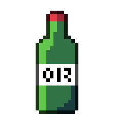
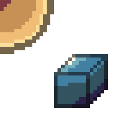
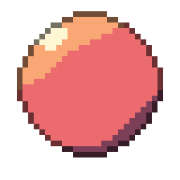

# 🎨 PixelArtJourney

Pixel arts quotidiens - Sprites créés avec [Aseprite](https://www.aseprite.org/).

**4 sprites • 3 jours • 5 frames au total**

Dernière mise à jour : 04 June 2026 à 23:07 UTC

---

## Jour 1 - slime

  
   
  <em>slime - 2 frames</em>

---

## Jour 2 - soju

  
   
  <em>soju - 1 frame</em>

---

## Jour 3 - cube, sphere

<table>
  <tr>
    <td align="center">
  
   
  <em>cube - 1 frame</em>
</td>
    <td align="center">
  
   
  <em>sphere - 1 frame</em>
</td>
  </tr>
</table>

---

